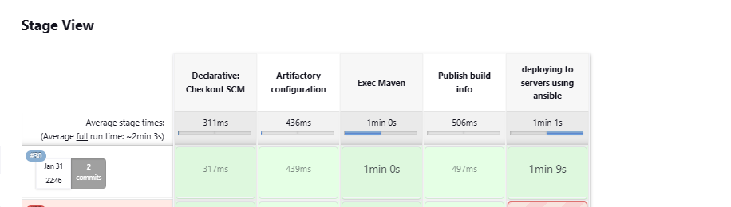
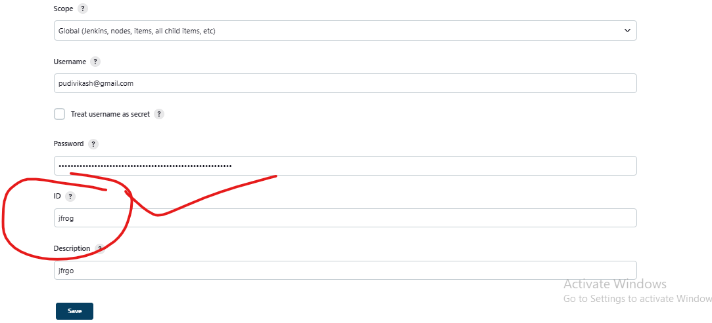

# **Full pipeline**
---------------------

## **This document describes the full pipelie line of the JAVA project with the follwig stages .**
  * git checkout
  * build & SonarQube analysis
  * Quality Gate
  * junit testResults
  * rtServer (artifactory configuration) , rtMavenDeployer (repository choosing )
  * rtMavenRun (execute maven goals)
  * Publish build info
  * creating infra
  * provising infra(depolying appilication)
  * 

* ## prereusites 
   * jenkins setup with atleast one node
   * installed java and maven on the node
   * configure maven  in manage jenkins -> global tool conguration 
      * this is used in 'rtMavenRun tool section'. 
             
         .
      * configure sonarqube in manage jenkins -> system configuration
      * 
    *  docker pipeline plugin installed. 
    * write jenkis file where the code is present . ie SCM
    * a branchig strategy ( here we follw github branching strategy ie. here we have four branches every branch a pipeline on the dev branch for every commit we triggr the build. on the testing branch we configure cronjob  )
 ###  build & SonarQube analysis
  ```bash
   stage("build & SonarQube analysis") {
            steps {
              sh' echo ***********SONAR SCANING************************'
              withSonarQubeEnv('sonarqube') {
                sh "mvn package sonar:sonar"}
              }
            }
  ```
* ###  Quality Gate stage
  ```bash
  stage("Quality Gate") {
            steps {
              sh' echo ***********QUALITY GATE************************'
              timeout(time: 30, unit: 'MINUTES') {
                waitForQualityGate abortPipeline: true
              }
            }
          }
  ```
*  ### junit testResults
  ```
  junit testResults: 'target/surefire-reports/*.xml'
  ```
*  ### rtServer 
  ```bash
   rtServer (
                  id: 'Artifactory',
                  url: "https://skyislimit.jfrog.io/artifactory/",
                  credentialsId: 'jfrog',
                   bypassProxy: true,
                   timeout: 300
                       )
  ```
   * id: this will be used when ever uwant your server configuration
   * url: this is our artifactory url 
   * credentialsId : give the id which u configure in the jenkis credentals
       manage jenkins -> manage credentials
        
*  ### rtMavenDeployer
``` bash
    rtMavenDeployer (
                        id: "spc_DEPLOYER",
                        serverId: "Artifactory",
                        releaseRepo: "demo",
                        snapshotRepo: "snapdemo"
                                )
```
    * id will be used in further steps
    * give id whic u haven given in rtserver
    * give the repositery names where u want to preserve the artifact
*  ###  rtMavenRun
  ```bash
  rtMavenRun (
                    tool: "maven", // Tool name from Jenkins configuration
                     pom: "pom.xml",
                     goals: "install ",
                     deployerId: "spc_DEPLOYER"
                 )
  ```
    * tool: which was given in global tools
    * pom: path of your pm.xml file
    * goals: maven goals
    * deployerId : wich was given in the rtMavenDeployers id section
*  ### Publish build info
```bash 
rtPublishBuildInfo (
                    serverId: "Artifactory"
                )
```
 * after uploading publish the details in the jenkins build page
## Creating an infrastructure 
* for this in the node we must HAVE infra provisioning tool
* here we r using terraform for infraprovisng 
* the folling are tf files
      1.provide.tf [refer here](infra/provider.tf)
      2.main.tf [refer here](infra/main.tf)
      3.nsg [refer here](infra/nsg.tf)
      4.backend.tf [refer here](infra/backend.tf)
 * after creating infra we need to depoly our application(which is build in the previous stage)
 * in provisng we use ansible .
 * the follwing is the 
  ```
   provisioner "local-exec" {
    //command = "ls"
    command = "pwd && ansible-playbook -i ${azurerm_linux_virtual_machine.VM1.public_ip_address playbook.yaml"
      
  }
  ```

  * the following is the playbook
  ```
  ---
- name: install lamp stack
  hosts: all
  become: yes
  tasks:
    - name: update ubuntu packages
      apt:
        update_cache: yes 
    - name: download jfrog artifact
      ansible.builtin.command: wget --user=pudivikash@gmail.com   --password=cmVmdGtuOjAxOjE3MDY3MzcwMjI6cE00aUlVenp1bzROOGdCWFlUM2lHM2R2dmhz  https://skyislimit.jfrog.io/artifactory/demo/org/springframework/samples/spring-petclinic/2.7.4/spring-petclinic-2.7.4.jar
    - name: copy file
      ansible.builtin.copy:
        src: /home/murali/remot/workspace/ansibleintigration/infra/springpetclinic.service
        dest: /etc/systemd/system/springpetclinic.service
        
    - name: jar file copy
      ansible.builtin.copy:
        src: spring-petclinic-2.7.4.jar
        dest: /home/murali/spring-petclinic-2.7.4.jar
        remote_src: true
    - name: service started and reload
      ansible.builtin.systemd:
        state: restarted
        daemon_reload: yes
        name: springpetclinic
  ```   
* the service file is 
  ```
      [Unit]
      Description=springpetclinic java application
      [Service]
      User=murali
      # The configuration file application.properties should be here:

      #change this to your workspace
      WorkingDirectory=/home/murali/

      #path to executable.
      #executable is a bash script which calls jar file
      ExecStart=/usr/bin/java -jar spring-petclinic-2.7.4.jar

      SuccessExitStatus=143
      TimeoutStopSec=10
      Restart=on-failure
      RestartSec=5

      [Install]
      WantedBy=multi-user.target
  ```